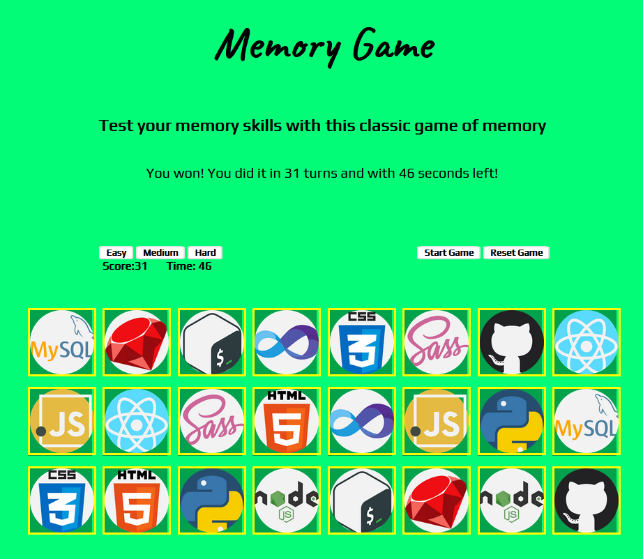
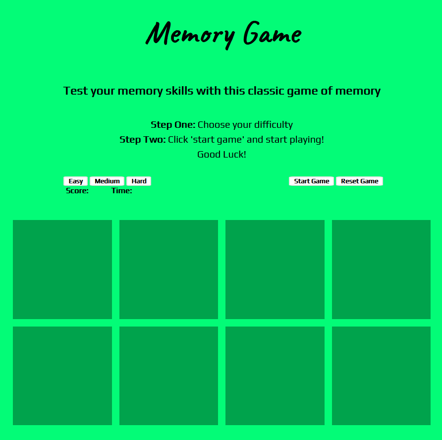
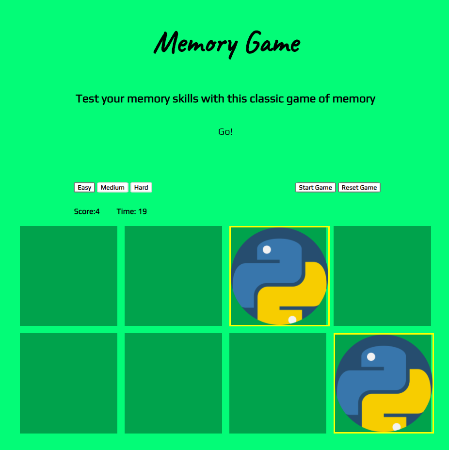

# Memory Match Browser-based Game

## Overview  
Play the classic game of memory in your browser with no sign-up or subscriptions required! 

---

## Technologies Used

For this game the following languages and frameworks were used:

1. Javascript
2. HTML5
3. CSS
4. jQuery

---

## Getting Started

To get started playing first [click here!](https://m4tth3wp.github.io/memory-match-game/)

- First pick a difficulty; easy, medium, or hard.
- Easy difficulty will render eight cards to the page and you have 30 seconds to match them all!
- Medium difficulty will render 16 cards to the page and you have 60 seconds to match them all!
- Hard difficulty will render 24 cards to the page and you have 120 seconds to match them all!

Once you have selected a difficult, the cards are rendered to the screen, click 'start game' and begin! 

Here is what the board looks like when easy difficulty is chosen:

Once you are playing click on the cards to reveal the image; after the second image is selected, Javascript will determine if it is a match or not. If it is, a yellow border will appear and you will hear a chime! The images stay open until all cards have been successfully chosen:

See if you can name all the icons as well on your own! 

---

## Next Steps:

- In the future the game will have the ability to keep track of players scores, and to adjust the speed and time of the game as well. 
- New themes for the game are also a upcoming feature in the works as well!